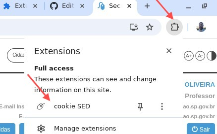

# cookieSED
Esta extensão Chrome envia o cookie SED para [planilha CEEJA](https://is.gd/pceeja).

## Como instalar

Abra o navegador Chrome. Se estiver logado como professor, saia da conta.

Extraia o arquivo [cookieSED.zip](https://tarcisomesquita.github.io/cookieSED/cookieSED.zip)

Na pasta Downloads, clique com o botão direito em cookieSED.zip e escolha extrair tudo.

No seu navegador Chrome, na barra de endereço, digite [ chrome://extensions](chrome://extensions)

No canto superior direito, ative o "Developer mode".

No canto superior esquerdo, clique no botão "Load unpacked". Na janela aberta, vá até a pasta dos arquivos que baixou (vai ver a pasta sem arquivos). Clique no botão "Open".

Navegue até o site da [SED](https://sed.educacao.sp.gov.br/Inicio), no canto superior direito clique na peça de quebra-cabeça, depois clique em "cookie SED". Clique no botão azul "Enviar cookie SED".

---

Autor: [Tarciso Mesquita](https://tarcisomesquita.github.io)

Esta obra está licenciada com uma Licença [Creative Commons Atribuição 4.0 Internacional](http://creativecommons.org/licenses/by/4.0/deed.pt_BR)

